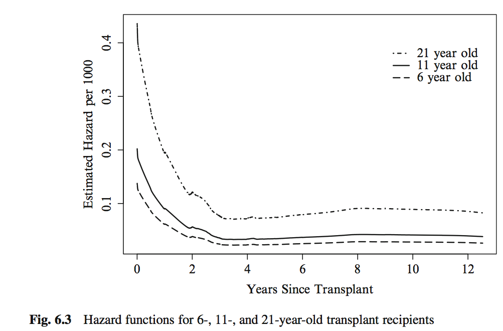

# Learning objectives and outline

## Learning objectives

1. Define proportional hazards
2. Perform and interpret Cox proportional hazards regression
3. Identify the differences between parametric and semi-parametric survival models
4. Identify situations when a parametric survival model might be useful

## Outline

1. Review of Survival function and Kaplan-Meier estimator
2. Hazard function
3. Cox regression
    + the Cox proportional hazards model
    + proportional hazards
    + interpretation and inference from the Cox model

* Vittinghoff sections 6.1-6.2, 6.4

# Review of Survival and hazard functions

## Recall leukemia Example
* Study of 6-mercaptopurine (6-MP) maintenance therapy for children in remission from acute lymphoblastic leukemia (ALL)
* 42 patients achieved remission from induction therapy and were then randomized in equal numbers to 6-MP or placebo.
* Survival time studied was from randomization until relapse.

## Leukemia follow-up table


This is the **Kaplan-Meier Estimate** $\hat S(t)$ of the Survival function $S(t)$.

## Leukemia Kaplan-Meier plot

```{r, echo=FALSE, message=FALSE}
library(survival)
library(survminer)
library(tidyverse)
leuk <- read_csv("leuk.csv")
leuk <- leuk %>%
  mutate(group = factor(group, levels = c("Placebo", "6 MP")))
kmfit <- survival::survfit(Surv(time, cens) ~ group, data = leuk)
survminer::ggsurvplot(kmfit, risk.table = TRUE, linetype=1:2)
``````

## The hazard function h(t)

* *Definition*: The *survival function* at time t, denoted $S(t)$, is the probability of being event-free at t.  Equivalently, it is the probability that the survival time is greater than t.

* *Definition*:  The *cumulative event function* at time t, denoted $F(t)$, is the probability that the event has occurred by time t, or equivalently, the probability that the survival time is less than or equal to t. $F(t) = 1-S(t)$.

* *Definition*: The *hazard function* $h(t)$ is the short-term event rate for subjects who have not yet experienced an event.
    + $h(t)$ is the probability of an event in the time interval $[t, t+s]$ (s is small), given that the individual has survived up to time t
$$h(t) = \lim_{s \to 0} \frac{Pr(t \leq T < t+s | T \ge t)}{s}$$


## Leukemia dataset $S(t) $

Survival function $S(t)$

```{r, echo=FALSE}
## KM plot
survminer::ggsurvplot(
  kmfit,
  lty.surv = 1:2,
  col.surv = 2:1,
  xlab = "Time (weeks)",
  ylab = "Survival Probability"
)
```

## Leukemia dataset $h(t)$

Hazard function $h(t)$

```{r, echo=FALSE, message=FALSE}
## hazard plot
library(muhaz)
haztreat = with(leuk[leuk$group == "6 MP",], muhaz(time, cens))
hazcontrol = with(leuk[leuk$group == "Placebo",], muhaz(time, cens))
plot(hazcontrol,
     lwd = 2,
     xlab = "Follow-up time (weeks)",
     xlim = c(0, 18))
lines(haztreat,
      lty = 2,
      lwd = 2,
      col = "red")
legend(
  "topright",
  legend = c("Control", "Treatment"),
  lty = 1:2,
  lwd = 2,
  col = c("black", "red")
)
```

\footnotesize
* See http://sas-and-r.blogspot.com/2010/06/example-741-hazard-function-plotting.html for R + SAS instructions

## The Hazard Ratio (HR)

* If we are comparing the hazards of a control and a treatment group, it could in general be a function of time:
    + $HR(t) = h_T(t) / h_C(t)$
* Interpretation: the risk of event for the treatment group compared to the control group, as a function of time

## The Proportional Hazards Assumption

* *Definition*: Under the *proportional hazards assumption*, the hazard ratio does not vary with time. That is, $HR(t) \equiv HR$.

* In other words, $HR$ does not vary with time
    + $HR(t)$ is a constant, $HR$, at *all times* t
    + this assumption is about the population, of course there will be sampling variation

## A nice proportional hazards dataset



## The hazard function h(t) (leukemia dataset)

```{r, echo=FALSE}
## KM plot
ggsurvplot(
  kmfit,
  lty.surv = 1:2,
  col.surv = 2:1,
  xlab = "Time (weeks)",
  ylab = "Survival Probability"
)
## hazard plot
leuk %>% group_by(group) %>% 
  summarise(haz = list(muhaz(time, cens)))

haztreat = with(leuk[leuk$group == "6 MP",], muhaz(time, cens))
hazcontrol = with(leuk[leuk$group == "Placebo",], muhaz(time, cens))
plot(hazcontrol,
     lwd = 2,
     xlab = "Follow-up time (weeks)",
     xlim = c(0, 18))
lines(haztreat,
      lty = 2,
      lwd = 2,
      col = "red")
legend(
  "topright",
  legend = c("Control", "Treatment"),
  lty = 1:2,
  lwd = 2,
  col = c("black", "red")
)
```

## Log-minus-log plot

```{r, echo=FALSE}
ggsurvplot(
  kmfit,
  fun = "cloglog",
  risk.table = FALSE,
  linetype = 1:2,
  main = "log-minus-log plot for Leukemia dataset"
)
```

## Recall previous regression models

$$
E[y_i|x_i] = \beta_0 + \beta_1 x_{1i} + \beta_2 x_{2i} + ... + \beta_p x_{pi}
$$

* $x_p$ are the predictors or independent variables
* $y$ is the outcome, response, or dependent variable
* $E[y|x]$ is the expected value of $y$ given $x$
* $\beta_p$ are the regression coefficients

For logistic regression:
$$
Logit(P(x_i)) = log \left( \frac{P(x_i)}{1-P(x_i)} \right) = \beta_0 + \beta_1 x_{1i} + \beta_2 x_{2i} + ... + \beta_p x_{pi}
$$

For log-linear regression:
$$
log(E[y_i|x_i]) = \beta_0 + \beta_1 x_{1i} + \beta_2 x_{2i} + ... + \beta_p x_{pi}
$$

# Cox proportional hazards model

## Cox proportional hazards model

* Cox proportional hazards regression assesses relationship between a right-censored, time-to-event outcome and predictors:
    + categorical variables (e.g., treatment groups)
    + continuous variables
$$
log(HR(x_i)) = log \frac{h(t|x_i)}{h_0(t)} = \beta_0 + \beta_1 x_{1i} + \beta_2 x_{2i} + ... + \beta_p x_{pi}
$$
* $HR(x_i)$ is the hazard of patient $i$ relative to baseline
* $h(t|x_i)$ is the time-dependent hazard function $h(t)$ for patient $i$
* $h_0(t)$ is the *baseline hazard function*

Multiplicative or additive model?

## Interpretation of coefficients

* Coefficients $\beta$ for a categorical / binary predictor:
    + $\beta$ is the $log$ of the ratio of hazards for the comparison group relative to reference group ($log(HR)$)
* Coefficients $\beta$ for a continuous predictor:
    + $\beta$ is the $log$ of the ratio of hazards for someone having a one unit higher value of $x$ (1 year, 1mm Hg, etc)

* If the hazard ratio ($exp(\beta)$) is close to 1 then the predictor does not affect survival
* If the hazard ratio is less than 1 then the predictor is protective (associated with improved survival)
* If the hazard ratio is greater than 1 then the predictor is associated with increased risk (= decreased survival)


## Hypothesis testing and CIs

* Wald Test or Likelihood Ratio Test for coefficients
    + $H_0: \beta=0, H_a: \beta \neq 0$ 
    + equivalent to $H_0: HR=1, H_a: HR \neq 1$
* CIs typically obtained from Wald Test, reported for $HR$

## CoxPH regression for Leukemia dataset

\tiny
```{r, echo=FALSE, message=FALSE}
coxfit <- coxph(Surv(time, cens) ~ group, data = leuk)
summary(coxfit)
```

## Cox PH is a semi-parametric model

* Cox proportional hazards model is _semi-parametric_:
    + assumes proportional hazards (PH), but no assumption on $h_0(t)$
    + robust if PH assumption is not violated
    + time-dependent covariates may resolve apparent violations of the PH assumption.

## Summary: proportional hazards assumption

* Constant hazard _ratio_ between groups over time (proportional hazards)
* A linear association between the natural log of the relative hazard and the predictors (log-linearity)
    + A multiplicative relationship between the predictors and the hazard
* Uninformative censoring

## What to do when proportional hazards doesn't hold?

* **Time-dependent covariates**
* **Definition**: A time-dependent covariate is a predictor whose values may vary with time.
* **Basic rule**: You cannot look into the future in your analysis (even though it took place in the past) E.g.:
    + breast cancer chemotherapy patients divided into groups based on how much of the planned dose they received
    + patients divided into groups based on early response to treatment (shrinkage of tumor, lowering of cholesterol, etc)
    + interpolation of the values of a laboratory test linearly between observation times
    + removing subjects who do not finish the treatment plan
    + imputing the date of an adverse event as midway between observation times

Source: [Using Time Dependent Covariates and Time Dependent Coefficients in the Cox Model](https://cran.r-project.org/web/packages/survival/vignettes/timedep.pdf)

## Immortal time bias example

* Immortal time bias is an example of looking into the future.
* E.g. Yee *et al.* reported that new statin users reported a 26% reduction in the risk of diabetes progression with one year or more of treatment relative to never-users (adjusted HR 0.74, 95% CI: 0.56 to 0.97).
    + New users excludes those who had received a lipid lowering drug from three years before to six months after cohort entry
* This is a surprising finding because of confounding: people whose diabetes progresses are more likely to develop cardiovascular disease, an indication for statins.
    + would result in HR > 1
* This is a result of an analysis error. Why?

\tiny

* Yee *et al.* Statin use in type 2 diabetes mellitus is associated with a delay in starting insulin (http://onlinelibrary.wiley.com/doi/10.1111/j.1464-5491.2004.01263.x/full)

## Immortal time bias example (cont'd)

* What was the analysis error?
    + all person days between cohort entry and end of follow-up were **classified as treated** for those who met the statin user definition, regardless of the date on which they met this definition and as untreated for non-users
    + thus all persons in the *treated* group are "immortal" from time 0 until the initiation of statin treatment
    + this period of immortality makes treatment look more effective


# Parametric survival models

## What are "parametric" survival models?

* "Parametric" models estimate additional _parameters_ for the baseline hazard, e.g.:
    + **Weibull**: hazard function is a polynomial
    + **exponential**: hazard function is constant over time, survival function is exponential (special case of Weibull): e.g. healthy population with randomly occurring events
    + many other options for assumption of distributions
* In most common implementation a log-transform of the time variable is used
    + then can be interpreted as *Accelerated Failure Time* (AFT) models.

## Coefficients in parametric models

* The interpretation of $\beta$ coefficients is different:
    + Cox model: $log(HR)$
    + AFT models: $log(survival time ratio)$
    + The sign is *opposite* (_i.e._ if one is positive the other is negative)

## Why use a parametric survival model?

* Can be more powerful if assumption is correct
    + may help with small numbers of events
* Extra capabilities:
    + smooth estimation of baseline hazard
    + extrapolation
    + complicated censoring
* Easy to interpret: coefficients are $log(survival time ratio)$
* Easy to fit: replace `survival::coxph` with `survival::survreg`

## Why not to use a parametric survival model?

* Depend on correct specification of baseline hazard model
* Even if correctly specified, may not provide much improvement in efficiency
* Still make a proportionality assumption, on survival functions
